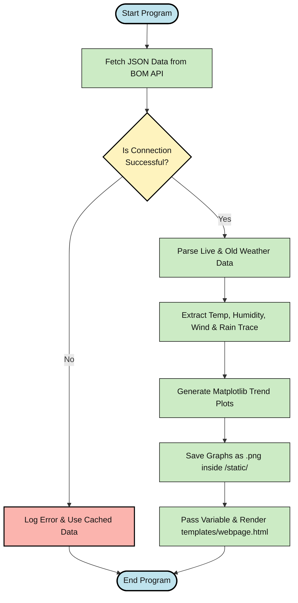

# ICTPRG434_AT3

```mermaid
flowchart TD
    Start([Start Program]) --> FetchData[Fetch JSON Data from BOM API]
    FetchData --> CheckConn{Is Connection<br>Successful?}

    %% Error Path
    CheckConn -- No --> LogError[Log Error & Use Cached Data]
    LogError --> End([End Program])

    %% Success Path
    CheckConn -- Yes --> ParseJSON[Parse Live & Old Weather Data]
    ParseJSON --> ExtractParams[Extract Temp, Humidity, Wind & Rain Trace]

    ExtractParams --> PlotGraphs[Generate Matplotlib Trend Plots]
    PlotGraphs --> SaveImages[Save Graphs as .png inside /static/]

    SaveImages --> RenderTemplate[Pass Variable & Render templates/webpage.html]
    RenderTemplate --> End

    %% Styling
    classDef startEnd fill:#bfe3ed,stroke:#000,stroke-width:2.5px,color:#111;
    classDef process fill:#ccebc5,stroke:#000,strok-width:2px,color:#111;
    classDef decision fill:#fef3be,stroke:#000,stroke-width:2px,color:#111;
    classDef error fill:#fbb4ae,stroke:#000,stroke-width:2px,color:#111;

    class Start,End startEnd;
    class FetchData,ParseJSON,ExtractParams,PlotGraphs,SaveImages,RenderTemplate process;
    class CheckConn decision;
    class LogError error;
```